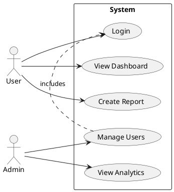

# 🎯 AI Development Master Protocol (ADMP) - Part 1
**Version**: 2.0  
**Last Updated**: January 2026  
**Purpose**: Universal Development Standard for AI-Assisted Software Engineering  
**Compliance**: ISO/IEC 25010, IEEE 829, PMBOK, SWEBOK, UML 2.5

---

## 📋 Table of Contents

1. [Protocol Overview](#1-protocol-overview)
2. [Pre-Development Phase](#2-pre-development-phase)
3. [Project Structure Standards](#3-project-structure-standards)
4. [Git Workflow Rules](#4-git-workflow-rules)
5. [Development Standards](#5-development-standards)

---

## 1. Protocol Overview

### 1.1 Mission Statement
> "Every AI agent must follow this protocol to ensure consistent, professional, and maintainable software delivery across all projects."

### 1.2 Core Principles (The 5 Cs)

```yaml
consistency: "Same rules, same results, every time"
completeness: "Nothing is done until it's tested, documented, and deployed"
clarity: "Code should read like well-written prose"
compliance: "All standards are non-negotiable"
continuous_improvement: "Every iteration makes the system better"
```

### 1.3 AI Agent Responsibilities

**BEFORE writing ANY code, the AI must:**

1. ✅ Read and acknowledge this entire protocol
2. ✅ Request missing information if specifications are incomplete
3. ✅ Create project structure following standards
4. ✅ Initialize Git repository with proper branches
5. ✅ Set up testing framework
6. ✅ Create documentation templates
7. ✅ Establish success criteria and KPIs

**THEN and ONLY THEN can development begin.**

---

## 2. Pre-Development Phase

### 2.1 Requirements Gathering Checklist

```markdown
## Project Initialization Questionnaire

### Business Context
- [ ] What problem does this solve? (Jobs to Be Done)
- [ ] Who are the users? (Personas)
- [ ] What is the success metric? (KPI)
- [ ] What is the timeline? (Roadmap)
- [ ] What is the budget constraint?

### Technical Context
- [ ] Technology stack preferences?
- [ ] Integration requirements?
- [ ] Performance requirements? (SLA)
- [ ] Security requirements? (Compliance)
- [ ] Scalability expectations?

### Quality Context
- [ ] Test coverage target? (Minimum: 80%)
- [ ] Documentation level? (Minimum: API + README)
- [ ] Code review process?
- [ ] CI/CD requirements?
```

### 2.2 Project Charter Template

```markdown
# Project Charter: [Project Name]

## Executive Summary
**Project Name**: [Name]
**Project Code**: [ABC-2026-001]
**Start Date**: [Date]
**Expected Duration**: [X weeks]
**Project Manager**: [Name]
**Technical Lead**: [Name]

## Objectives
1. [Primary objective with measurable outcome]
2. [Secondary objective]
3. [Tertiary objective]

## Scope
**In Scope:**
- [Feature 1]
- [Feature 2]
- [Feature 3]

**Out of Scope:**
- [Explicitly not included]
- [Future consideration]

## Stakeholders
| Role | Name | Responsibility |
|------|------|----------------|
| Sponsor | [Name] | Budget approval |
| Product Owner | [Name] | Requirements |
| Tech Lead | [Name] | Architecture |
| QA Lead | [Name] | Testing strategy |

## Success Criteria
- [ ] Criterion 1: [Measurable outcome]
- [ ] Criterion 2: [Measurable outcome]
- [ ] Criterion 3: [Measurable outcome]

## Risks
| Risk | Probability | Impact | Mitigation |
|------|------------|--------|------------|
| [Risk 1] | High/Med/Low | High/Med/Low | [Strategy] |

## Approval
- [ ] Sponsor Sign-off
- [ ] Tech Lead Sign-off
- [ ] Budget Allocated
```

### 2.3 Architecture Decision Records (ADR)

**Template: `docs/adr/ADR-001-[decision-title].md`**

```markdown
# ADR-001: [Decision Title]

**Date**: YYYY-MM-DD
**Status**: Proposed | Accepted | Deprecated | Superseded
**Deciders**: [Names]
**Technical Story**: [Issue #XXX]

## Context
[Describe the forces at play, including technological, political, social, and project local]

## Decision
[Describe the response to these forces]

## Consequences
**Positive:**
- [Benefit 1]
- [Benefit 2]

**Negative:**
- [Trade-off 1]
- [Trade-off 2]

**Neutral:**
- [Impact 1]

## Alternatives Considered
1. **Alternative A**: [Why rejected]
2. **Alternative B**: [Why rejected]
```

### 2.4 UML Diagrams Required

**Before coding, create these diagrams:**

1. **Use Case Diagram** (`docs/diagrams/use-cases.puml`)
2. **Class Diagram** (`docs/diagrams/class-diagram.puml`)
3. **Sequence Diagram** (`docs/diagrams/sequences/`)
4. **Component Diagram** (`docs/diagrams/components.puml`)
5. **Deployment Diagram** (`docs/diagrams/deployment.puml`)
6. **State Machine Diagram** (if applicable)
7. **Activity Diagram** (for complex workflows)

**Example Use Case Diagram:**



---

## 3. Project Structure Standards

### 3.1 Universal Directory Structure

```
project-root/
├── .github/
│   ├── workflows/
│   │   ├── ci.yml
│   │   ├── cd.yml
│   │   └── tests.yml
│   ├── ISSUE_TEMPLATE/
│   │   ├── bug_report.md
│   │   ├── feature_request.md
│   │   └── documentation.md
│   └── PULL_REQUEST_TEMPLATE.md
│
├── docs/
│   ├── adr/                          # Architecture Decision Records
│   ├── api/                          # API documentation
│   ├── diagrams/                     # UML and other diagrams
│   ├── guides/                       # User guides
│   ├── PROJECT_CHARTER.md
│   ├── ARCHITECTURE.md
│   └── CHANGELOG.md
│
├── src/                              # Source code
│   ├── core/                         # Core business logic
│   ├── api/                          # API layer
│   ├── services/                     # Service layer
│   ├── models/                       # Data models
│   ├── utils/                        # Utilities
│   └── config/                       # Configuration
│
├── tests/
│   ├── unit/                         # Unit tests
│   ├── integration/                  # Integration tests
│   ├── e2e/                          # End-to-end tests
│   ├── fixtures/                     # Test data
│   └── mocks/                        # Mock objects
│
├── scripts/
│   ├── setup/                        # Setup scripts
│   ├── deploy/                       # Deployment scripts
│   ├── migrate/                      # Migration scripts
│   └── seed/                         # Seed data scripts
│
├── config/
│   ├── development.yml
│   ├── staging.yml
│   ├── production.yml
│   └── test.yml
│
├── .gitignore
├── .editorconfig
├── .eslintrc (or equivalent linter config)
├── .prettierrc (or equivalent formatter config)
├── README.md
├── CONTRIBUTING.md
├── LICENSE
├── SECURITY.md
└── package.json (or equivalent dependency file)
```

### 3.2 Naming Conventions

**Files & Directories:**
```yaml
python:
  files: "snake_case.py"
  classes: "PascalCase"
  functions: "snake_case"
  constants: "UPPER_SNAKE_CASE"
  
javascript:
  files: "camelCase.js or kebab-case.js"
  classes: "PascalCase"
  functions: "camelCase"
  constants: "UPPER_SNAKE_CASE"
  
general:
  configs: "kebab-case.yml"
  docs: "UPPER_CASE.md or kebab-case.md"
  tests: "test_file_name.py or fileName.test.js"
```

**Git Branches:**
```
feature/ABC-123-short-description
fix/ABC-124-bug-description
hotfix/ABC-125-critical-fix
docs/ABC-126-documentation-update
refactor/ABC-127-code-improvement
chore/ABC-128-maintenance-task
```

---

## 4. Git Workflow Rules

### 4.1 Branch Strategy (GitFlow Modified)

```
main (production)
  ↑
  └── release/v1.x.x (release candidates)
        ↑
        └── dev (integration branch)
              ↑
              ├── feature/ABC-xxx (new features)
              ├── fix/ABC-xxx (bug fixes)
              └── docs/ABC-xxx (documentation)
```

### 4.2 Branch Protection Rules

**`main` Branch:**
- ❌ Direct commits prohibited
- ✅ Requires Pull Request
- ✅ Requires 2+ approvals
- ✅ All tests must pass
- ✅ No merge conflicts
- ✅ Up-to-date with base branch

**`dev` Branch:**
- ❌ Direct commits discouraged
- ✅ Requires Pull Request
- ✅ Requires 1+ approval
- ✅ All tests must pass

### 4.3 Commit Message Standard (Conventional Commits)

**Format:**
```
<type>(<scope>): <subject>

<body>

<footer>
```

**Types:**
- `feat`: New feature
- `fix`: Bug fix
- `docs`: Documentation changes
- `style`: Code style changes (formatting, no logic change)
- `refactor`: Code refactoring
- `perf`: Performance improvements
- `test`: Adding or updating tests
- `chore`: Maintenance tasks
- `ci`: CI/CD changes

**Examples:**
```
feat(auth): add JWT token validation

Implement JWT token validation middleware that checks:
- Token expiration
- Token signature
- User permissions

Closes #123
```

```
fix(api): resolve race condition in user creation

Previously, concurrent requests could create duplicate users.
Added transaction lock to ensure atomicity.

Fixes #456
Related to #457
```

### 4.4 Pull Request Protocol

**PR Title Format:**
```
[TYPE] Brief description (#Issue-Number)
```

**PR Template:**

```markdown
## 📝 Description
[Clear description of what this PR does]

## 🔗 Related Issues
Closes #XXX
Related to #YYY

## 🎯 Type of Change
- [ ] Bug fix (non-breaking change which fixes an issue)
- [ ] New feature (non-breaking change which adds functionality)
- [ ] Breaking change (fix or feature that would cause existing functionality to not work as expected)
- [ ] Documentation update
- [ ] Refactoring (no functional changes)

## ✅ Checklist
- [ ] My code follows the style guidelines of this project
- [ ] I have performed a self-review of my own code
- [ ] I have commented my code, particularly in hard-to-understand areas
- [ ] I have made corresponding changes to the documentation
- [ ] My changes generate no new warnings
- [ ] I have added tests that prove my fix is effective or that my feature works
- [ ] New and existing unit tests pass locally with my changes
- [ ] Any dependent changes have been merged and published

## 🧪 Testing
**Test Coverage:** X%

**Test Cases:**
- [x] Test case 1: Description
- [x] Test case 2: Description
- [ ] Test case 3: Description (if applicable)

**Manual Testing:**
- [x] Tested on local environment
- [ ] Tested on staging environment (if applicable)

## 📸 Screenshots (if applicable)
[Add screenshots for UI changes]

## 🚀 Deployment Notes
[Any special deployment instructions]

## 📚 Additional Context
[Any additional information reviewers should know]
```

### 4.5 AI Agent Git Commands Sequence

**When creating a new feature:**

```bash
# 1. Ensure dev is up to date
git checkout dev
git pull origin dev

# 2. Create feature branch
git checkout -b feature/ABC-123-description

# 3. Implement feature
# [Development happens here]

# 4. Stage and commit
git add .
git commit -m "feat(module): description

Detailed explanation of changes.

Closes #123"

# 5. Push to remote
git push origin feature/ABC-123-description

# 6. Create PR using GitHub CLI
gh pr create --base dev --title "[FEAT] Description (#123)" --body-file .github/pr-template.md

# 7. After approval, merge and delete branch
gh pr merge --squash --delete-branch
```

---

## 5. Development Standards

### 5.0 Language Flexibility & Hybrid Architectures

**The protocol supports:**
- **Single-language projects**: Python-only, Node.js-only, Java-only, etc.
- **Hybrid architectures**: Common patterns include:
  - Backend: Node.js/Express + Frontend: React/Vite
  - Backend: Python/FastAPI + Frontend: Vue.js
  - Backend: Go + Frontend: Svelte
  - Microservices: Mix of languages per service
  - Agent systems: Python for AI/ML + Node.js for APIs

**Architecture Decision Requirements:**
- Document language choices in ADR
- Justify hybrid approach if used
- Define inter-service communication (REST, GraphQL, gRPC, Message Queue)
- Specify deployment strategy per component

**Example Hybrid Stack Documentation:**
```yaml
project_architecture:
  backend:
    language: "Node.js 20+"
    framework: "Express.js"
    port: 4123
    responsibilities: ["API Gateway", "Business Logic", "Agent Orchestration"]
  
  frontend:
    language: "JavaScript/React"
    framework: "Vite"
    port: 4124
    responsibilities: ["UI/UX", "Real-time updates", "Dashboard"]
  
  ai_agents:
    language: "Python 3.11+"
    framework: "Custom classes"
    responsibilities: ["LLM Integration", "Scraping", "Content Generation"]
  
  database:
    type: "PostgreSQL"
    port: 5432
    
  cache:
    type: "Redis"
    port: 6379
  
  llm_service:
    type: "Ollama"
    port: 11434
    models: ["llama3:latest", "codellama:latest"]
```

### 5.1 SOLID Principles (Non-Negotiable)

**S - Single Responsibility Principle**
```python
# ❌ BAD: Class doing too much
class UserManager:
    def create_user(self, data):
        # Creates user
        # Sends email
        # Logs activity
        # Updates analytics
        pass

# ✅ GOOD: Single responsibility
class UserRepository:
    def create(self, user): pass

class EmailService:
    def send_welcome_email(self, user): pass

class AuditLogger:
    def log_user_creation(self, user): pass

class AnalyticsService:
    def track_user_signup(self, user): pass
```

**O - Open/Closed Principle**
```python
# ❌ BAD: Must modify class to add new payment method
class PaymentProcessor:
    def process(self, payment_type):
        if payment_type == "credit_card":
            # Process credit card
        elif payment_type == "paypal":
            # Process PayPal
        # Adding new method requires modifying this class

# ✅ GOOD: Open for extension, closed for modification
class PaymentMethod:
    def process(self): raise NotImplementedError

class CreditCardPayment(PaymentMethod):
    def process(self): pass

class PayPalPayment(PaymentMethod):
    def process(self): pass

class PaymentProcessor:
    def process(self, payment_method: PaymentMethod):
        payment_method.process()
```

**L - Liskov Substitution Principle**
```python
# ❌ BAD: Subclass changes expected behavior
class Bird:
    def fly(self): pass

class Penguin(Bird):
    def fly(self):
        raise Exception("Penguins can't fly!")  # Violates LSP

# ✅ GOOD: Proper abstraction
class Bird:
    def move(self): pass

class FlyingBird(Bird):
    def fly(self): pass

class Penguin(Bird):
    def swim(self): pass
```

**I - Interface Segregation Principle**
```python
# ❌ BAD: Fat interface
class Worker:
    def work(self): pass
    def eat(self): pass
    def sleep(self): pass

# Robots shouldn't need to implement eat() and sleep()

# ✅ GOOD: Segregated interfaces
class Workable:
    def work(self): pass

class Eatable:
    def eat(self): pass

class Sleepable:
    def sleep(self): pass

class Human(Workable, Eatable, Sleepable):
    pass

class Robot(Workable):
    pass
```

**D - Dependency Inversion Principle**
```python
# ❌ BAD: High-level module depends on low-level module
class MySQLDatabase:
    def connect(self): pass

class UserService:
    def __init__(self):
        self.db = MySQLDatabase()  # Tight coupling

# ✅ GOOD: Both depend on abstraction
class Database:
    def connect(self): raise NotImplementedError

class MySQLDatabase(Database):
    def connect(self): pass

class PostgreSQLDatabase(Database):
    def connect(self): pass

class UserService:
    def __init__(self, database: Database):
        self.db = database  # Loose coupling
```

### 5.2 Clean Code Principles

**Meaningful Names:**
```python
# ❌ BAD
d = 86400  # What is this?
def calc(x, y):
    return x * y

# ✅ GOOD
SECONDS_PER_DAY = 86400
def calculate_rectangle_area(width: float, height: float) -> float:
    return width * height
```

**Functions Should Do One Thing:**
```python
# ❌ BAD
def process_order(order):
    # Validates order
    # Calculates total
    # Charges payment
    # Sends email
    # Updates inventory
    pass

# ✅ GOOD
def process_order(order):
    validated_order = validate_order(order)
    total = calculate_total(validated_order)
    payment = charge_payment(total)
    send_confirmation_email(order.customer, payment)
    update_inventory(order.items)
```

**Comments Explain Why, Not What:**
```python
# ❌ BAD
# Increment counter by 1
counter += 1

# ✅ GOOD
# We use exponential backoff to avoid overwhelming the API
retry_delay = base_delay * (2 ** attempt_count)
```

### 5.3 Code Quality Checklist

```markdown
## Before Committing Code

### Functionality
- [ ] Code works as intended
- [ ] All edge cases handled
- [ ] Error handling implemented
- [ ] Input validation present

### Readability
- [ ] Variable names are descriptive
- [ ] Functions are small (<50 lines)
- [ ] No magic numbers
- [ ] Complex logic is commented

### Maintainability
- [ ] No code duplication (DRY)
- [ ] Functions do one thing (SRP)
- [ ] Dependencies are injected
- [ ] Configuration is externalized

### Performance
- [ ] No obvious performance issues
- [ ] Database queries are optimized
- [ ] Appropriate data structures used
- [ ] No unnecessary loops

### Security
- [ ] Input is sanitized
- [ ] No hardcoded secrets
- [ ] Authentication/authorization implemented
- [ ] OWASP Top 10 considered

### Testing
- [ ] Unit tests written
- [ ] Integration tests written (if applicable)
- [ ] Test coverage >80%
- [ ] All tests pass
```

---

## 5.5 Mandatory LLM/AI Integration

**CRITICAL**: Every modern AI-assisted project MUST include LLM integration as a first-class component.

### 5.5.1 LLM Integration Architecture

**Standard Pattern:**
```
┌─────────────────────────────────────────────────────────┐
│                   Application Layer                     │
│  (Express API, FastAPI, Flask, Spring Boot, etc.)      │
└─────────────────┬───────────────────────────────────────┘
                  │
                  ▼
┌─────────────────────────────────────────────────────────┐
│              LLM Abstraction Layer                      │
│  (Unified interface for multiple LLM providers)        │
│  • Ollama (local, privacy-first)                       │
│  • OpenAI API (GPT-4, GPT-3.5)                         │
│  • Anthropic Claude API                                 │
│  • Google Gemini API                                    │
│  • Cohere API                                           │
└─────────────────┬───────────────────────────────────────┘
                  │
                  ▼
┌─────────────────────────────────────────────────────────┐
│                 Agent/Tool Layer                        │
│  • Content Generation Agents                           │
│  • Analysis Agents                                      │
│  • Decision Support Agents                             │
│  • Automation Agents                                    │
└─────────────────────────────────────────────────────────┘
```

### 5.5.2 LLM Provider Configuration

**File: `config/llm-providers.yml`**

```yaml
llm_providers:
  # Local-first (recommended for development and privacy)
  ollama:
    enabled: true
    host: "http://localhost:11434"
    default_model: "llama3:latest"
    models:
      code_generation: "codellama:latest"
      chat: "llama3:latest"
      vision: "llava:latest"
      embedding: "nomic-embed-text:latest"
    timeout: 300
    max_retries: 3
  
  # Cloud providers (for production scale)
  openai:
    enabled: true
    api_key: "${OPENAI_API_KEY}"
    default_model: "gpt-4-turbo"
    models:
      chat: "gpt-4-turbo"
      completion: "gpt-3.5-turbo"
      embedding: "text-embedding-3-large"
    max_tokens: 4096
    temperature: 0.7
  
  anthropic:
    enabled: false
    api_key: "${ANTHROPIC_API_KEY}"
    default_model: "claude-3-opus-20240229"
    models:
      chat: "claude-3-opus-20240229"
      code: "claude-3-sonnet-20240229"
    max_tokens: 4096
  
  google:
    enabled: false
    api_key: "${GOOGLE_API_KEY}"
    default_model: "gemini-pro"
    models:
      chat: "gemini-pro"
      vision: "gemini-pro-vision"
  
  # Fallback strategy
  fallback_order: ["ollama", "openai", "anthropic", "google"]
  retry_on_failure: true
```

### 5.5.3 LLM Abstraction Layer Implementation

**File: `src/llm/LLMManager.js` (Node.js example)**

```javascript
class LLMManager {
  constructor(config) {
    this.providers = {
      ollama: new OllamaProvider(config.ollama),
      openai: new OpenAIProvider(config.openai),
      anthropic: new AnthropicProvider(config.anthropic),
      google: new GoogleProvider(config.google)
    };
    this.fallbackOrder = config.fallback_order;
  }

  async generate(prompt, options = {}) {
    const provider = options.provider || this.fallbackOrder[0];
    
    try {
      return await this.providers[provider].generate(prompt, options);
    } catch (error) {
      console.error(`Provider ${provider} failed:`, error.message);
      
      // Try fallback providers
      for (const fallbackProvider of this.fallbackOrder.slice(1)) {
        try {
          console.log(`Trying fallback provider: ${fallbackProvider}`);
          return await this.providers[fallbackProvider].generate(prompt, options);
        } catch (fallbackError) {
          continue;
        }
      }
      
      throw new Error('All LLM providers failed');
    }
  }

  async embed(text, options = {}) {
    const provider = options.provider || this.fallbackOrder[0];
    return await this.providers[provider].embed(text, options);
  }

  async chat(messages, options = {}) {
    const provider = options.provider || this.fallbackOrder[0];
    return await this.providers[provider].chat(messages, options);
  }
}

// Provider implementations
class OllamaProvider {
  constructor(config) {
    this.host = config.host;
    this.models = config.models;
  }

  async generate(prompt, options = {}) {
    const model = options.model || this.models.chat;
    const response = await fetch(`${this.host}/api/generate`, {
      method: 'POST',
      headers: { 'Content-Type': 'application/json' },
      body: JSON.stringify({
        model,
        prompt,
        stream: false,
        options: {
          temperature: options.temperature || 0.7,
          num_predict: options.max_tokens || 2000
        }
      })
    });
    
    const data = await response.json();
    return {
      text: data.response,
      model,
      provider: 'ollama',
      usage: { total_tokens: data.eval_count || 0 }
    };
  }

  async chat(messages, options = {}) {
    // Convert messages to Ollama format
    const prompt = messages.map(m => `${m.role}: ${m.content}`).join('\n');
    return this.generate(prompt, options);
  }

  async embed(text, options = {}) {
    const model = options.model || this.models.embedding;
    const response = await fetch(`${this.host}/api/embeddings`, {
      method: 'POST',
      headers: { 'Content-Type': 'application/json' },
      body: JSON.stringify({ model, prompt: text })
    });
    
    const data = await response.json();
    return { embedding: data.embedding, model, provider: 'ollama' };
  }
}

module.exports = { LLMManager, OllamaProvider };
```

**File: `src/llm/LLMManager.py` (Python example)**

```python
from typing import List, Dict, Optional
import requests
from abc import ABC, abstractmethod

class LLMProvider(ABC):
    @abstractmethod
    async def generate(self, prompt: str, options: Dict) -> Dict:
        pass
    
    @abstractmethod
    async def chat(self, messages: List[Dict], options: Dict) -> Dict:
        pass
    
    @abstractmethod
    async def embed(self, text: str, options: Dict) -> Dict:
        pass

class OllamaProvider(LLMProvider):
    def __init__(self, config: Dict):
        self.host = config['host']
        self.models = config['models']
    
    async def generate(self, prompt: str, options: Dict = {}) -> Dict:
        model = options.get('model', self.models['chat'])
        response = requests.post(
            f"{self.host}/api/generate",
            json={
                'model': model,
                'prompt': prompt,
                'stream': False,
                'options': {
                    'temperature': options.get('temperature', 0.7),
                    'num_predict': options.get('max_tokens', 2000)
                }
            }
        )
        
        data = response.json()
        return {
            'text': data['response'],
            'model': model,
            'provider': 'ollama',
            'usage': {'total_tokens': data.get('eval_count', 0)}
        }
    
    async def chat(self, messages: List[Dict], options: Dict = {}) -> Dict:
        prompt = '\n'.join([f"{m['role']}: {m['content']}" for m in messages])
        return await self.generate(prompt, options)
    
    async def embed(self, text: str, options: Dict = {}) -> Dict:
        model = options.get('model', self.models['embedding'])
        response = requests.post(
            f"{self.host}/api/embeddings",
            json={'model': model, 'prompt': text}
        )
        
        data = response.json()
        return {
            'embedding': data['embedding'],
            'model': model,
            'provider': 'ollama'
        }

class LLMManager:
    def __init__(self, config: Dict):
        self.providers = {
            'ollama': OllamaProvider(config['ollama']),
            # Add other providers
        }
        self.fallback_order = config['fallback_order']
    
    async def generate(self, prompt: str, options: Dict = {}) -> Dict:
        provider_name = options.get('provider', self.fallback_order[0])
        
        for provider_name in self.fallback_order:
            try:
                provider = self.providers[provider_name]
                return await provider.generate(prompt, options)
            except Exception as e:
                print(f"Provider {provider_name} failed: {e}")
                continue
        
        raise Exception('All LLM providers failed')
```

### 5.5.4 Agent Integration Pattern

**File: `src/agents/BaseAgent.js`**

```javascript
class BaseAgent {
  constructor(name, llmManager, config) {
    this.name = name;
    this.llm = llmManager;
    this.config = config;
  }

  async think(context) {
    // Use LLM for decision-making
    const prompt = this.buildPrompt(context);
    const response = await this.llm.generate(prompt, {
      model: this.config.model,
      temperature: this.config.temperature || 0.7,
      max_tokens: this.config.max_tokens || 2000
    });
    
    return this.parseResponse(response.text);
  }

  buildPrompt(context) {
    return `
You are ${this.name}, a specialized AI agent.

Your role: ${this.config.role}
Your responsibilities: ${this.config.responsibilities.join(', ')}

Current context:
${JSON.stringify(context, null, 2)}

Based on this context, provide your analysis and recommendations.
`;
  }

  parseResponse(text) {
    // Parse LLM response into structured data
    // Can include JSON extraction, regex patterns, etc.
    return text;
  }
}

class ContentAgent extends BaseAgent {
  constructor(llmManager, config) {
    super('ContentAgent', llmManager, config);
  }

  async generateContent(productName, niche, platform) {
    const prompt = `
Generate a ${platform} post for promoting:
Product: ${productName}
Niche: ${niche}

Requirements:
- Hook in first 3 seconds
- Value proposition clear
- Call to action
- Platform-specific format
- Engaging and authentic tone

Provide the content in JSON format:
{
  "hook": "...",
  "body": "...",
  "cta": "...",
  "hashtags": ["...", "..."]
}
`;
    
    const response = await this.llm.generate(prompt, {
      model: 'llama3:latest',
      temperature: 0.8
    });
    
    return JSON.parse(response.text);
  }
}

module.exports = { BaseAgent, ContentAgent };
```

### 5.5.5 API Endpoints for LLM Integration

**Required API Endpoints:**

```javascript
// File: src/routes/llm.routes.js

const express = require('express');
const router = express.Router();

/**
 * @route   POST /api/llm/generate
 * @desc    Generate text using LLM
 * @access  Private
 */
router.post('/generate', async (req, res) => {
  try {
    const { prompt, provider, model, options } = req.body;
    
    const result = await llmManager.generate(prompt, {
      provider,
      model,
      ...options
    });
    
    res.json({
      success: true,
      result
    });
  } catch (error) {
    res.status(500).json({
      success: false,
      error: error.message
    });
  }
});

/**
 * @route   POST /api/llm/chat
 * @desc    Chat with LLM
 * @access  Private
 */
router.post('/chat', async (req, res) => {
  try {
    const { messages, provider, model, options } = req.body;
    
    const result = await llmManager.chat(messages, {
      provider,
      model,
      ...options
    });
    
    res.json({
      success: true,
      result
    });
  } catch (error) {
    res.status(500).json({
      success: false,
      error: error.message
    });
  }
});

/**
 * @route   POST /api/llm/embed
 * @desc    Generate embeddings
 * @access  Private
 */
router.post('/embed', async (req, res) => {
  try {
    const { text, provider, model } = req.body;
    
    const result = await llmManager.embed(text, {
      provider,
      model
    });
    
    res.json({
      success: true,
      result
    });
  } catch (error) {
    res.status(500).json({
      success: false,
      error: error.message
    });
  }
});

/**
 * @route   GET /api/llm/providers
 * @desc    List available LLM providers and models
 * @access  Private
 */
router.get('/providers', async (req, res) => {
  try {
    const providers = await llmManager.getAvailableProviders();
    
    res.json({
      success: true,
      providers
    });
  } catch (error) {
    res.status(500).json({
      success: false,
      error: error.message
    });
  }
});

/**
 * @route   GET /api/llm/health
 * @desc    Check health of LLM providers
 * @access  Private
 */
router.get('/health', async (req, res) => {
  try {
    const health = await llmManager.checkHealth();
    
    res.json({
      success: true,
      health
    });
  } catch (error) {
    res.status(500).json({
      success: false,
      error: error.message
    });
  }
});

module.exports = router;
```

### 5.5.6 Agent API Endpoints

**File: `src/routes/agents.routes.js`**

```javascript
/**
 * @route   POST /api/agents/:agentName/execute
 * @desc    Execute agent task
 * @access  Private
 */
router.post('/:agentName/execute', async (req, res) => {
  try {
    const { agentName } = req.params;
    const { task, context, options } = req.body;
    
    const agent = agentManager.getAgent(agentName);
    const result = await agent.execute(task, context, options);
    
    res.json({
      success: true,
      agent: agentName,
      result
    });
  } catch (error) {
    res.status(500).json({
      success: false,
      error: error.message
    });
  }
});

/**
 * @route   GET /api/agents/:agentName/status
 * @desc    Get agent status
 * @access  Private
 */
router.get('/:agentName/status', async (req, res) => {
  try {
    const { agentName } = req.params;
    const agent = agentManager.getAgent(agentName);
    const status = await agent.getStatus();
    
    res.json({
      success: true,
      agent: agentName,
      status
    });
  } catch (error) {
    res.status(500).json({
      success: false,
      error: error.message
    });
  }
});

/**
 * @route   POST /api/agents/:agentName/train
 * @desc    Train agent with feedback
 * @access  Private
 */
router.post('/:agentName/train', async (req, res) => {
  try {
    const { agentName } = req.params;
    const { input, expected_output, actual_output, feedback } = req.body;
    
    const agent = agentManager.getAgent(agentName);
    const result = await agent.train({
      input,
      expected_output,
      actual_output,
      feedback
    });
    
    res.json({
      success: true,
      agent: agentName,
      result
    });
  } catch (error) {
    res.status(500).json({
      success: false,
      error: error.message
    });
  }
});
```

### 5.5.7 OpenAPI Specification for LLM APIs

**File: `docs/api/llm-openapi.yml`**

```yaml
openapi: 3.0.0
info:
  title: LLM Integration API
  version: 1.0.0
  description: API for interacting with multiple LLM providers

servers:
  - url: http://localhost:4123/api
    description: Development server

paths:
  /llm/generate:
    post:
      summary: Generate text using LLM
      requestBody:
        required: true
        content:
          application/json:
            schema:
              type: object
              required:
                - prompt
              properties:
                prompt:
                  type: string
                  example: "Write a marketing post for a fitness app"
                provider:
                  type: string
                  enum: [ollama, openai, anthropic, google]
                  default: ollama
                model:
                  type: string
                  example: "llama3:latest"
                options:
                  type: object
                  properties:
                    temperature:
                      type: number
                      minimum: 0
                      maximum: 2
                      default: 0.7
                    max_tokens:
                      type: integer
                      default: 2000
      responses:
        '200':
          description: Successful generation
          content:
            application/json:
              schema:
                type: object
                properties:
                  success:
                    type: boolean
                  result:
                    type: object
                    properties:
                      text:
                        type: string
                      model:
                        type: string
                      provider:
                        type: string
                      usage:
                        type: object

  /llm/chat:
    post:
      summary: Chat with LLM
      requestBody:
        required: true
        content:
          application/json:
            schema:
              type: object
              required:
                - messages
              properties:
                messages:
                  type: array
                  items:
                    type: object
                    properties:
                      role:
                        type: string
                        enum: [user, assistant, system]
                      content:
                        type: string
                provider:
                  type: string
                model:
                  type: string
      responses:
        '200':
          description: Chat response

  /agents/{agentName}/execute:
    post:
      summary: Execute agent task
      parameters:
        - name: agentName
          in: path
          required: true
          schema:
            type: string
            enum: [detector, content, instagram, learning, assets, git, manager]
      requestBody:
        required: true
        content:
          application/json:
            schema:
              type: object
              properties:
                task:
                  type: string
                context:
                  type: object
                options:
                  type: object
      responses:
        '200':
          description: Task executed successfully

components:
  securitySchemes:
    bearerAuth:
      type: http
      scheme: bearer
```

### 5.5.8 Environment Configuration

**File: `.env.example`**

```bash
# LLM Configuration
OLLAMA_HOST=http://localhost:11434
OLLAMA_MODEL=llama3:latest

# OpenAI (optional)
OPENAI_API_KEY=sk-...
OPENAI_MODEL=gpt-4-turbo

# Anthropic (optional)
ANTHROPIC_API_KEY=sk-ant-...
ANTHROPIC_MODEL=claude-3-opus-20240229

# Google (optional)
GOOGLE_API_KEY=...
GOOGLE_MODEL=gemini-pro

# Fallback strategy
LLM_FALLBACK_ORDER=ollama,openai,anthropic,google
LLM_RETRY_ON_FAILURE=true

# Agent Configuration
AGENT_TIMEOUT=300000
AGENT_MAX_RETRIES=3
```

### 5.5.9 Testing LLM Integration

**File: `tests/integration/llm.test.js`**

```javascript
const { LLMManager } = require('../../src/llm/LLMManager');
const config = require('../../config/llm-providers');

describe('LLM Integration Tests', () => {
  let llmManager;

  beforeAll(() => {
    llmManager = new LLMManager(config);
  });

  test('should generate text with Ollama', async () => {
    const result = await llmManager.generate('Hello, how are you?', {
      provider: 'ollama'
    });
    
    expect(result.text).toBeDefined();
    expect(result.provider).toBe('ollama');
  });

  test('should fallback to next provider on failure', async () => {
    // Simulate Ollama failure
    jest.spyOn(llmManager.providers.ollama, 'generate')
      .mockRejectedValueOnce(new Error('Connection failed'));
    
    const result = await llmManager.generate('Test prompt');
    
    expect(result.provider).not.toBe('ollama');
  });

  test('should generate embeddings', async () => {
    const result = await llmManager.embed('Test text for embedding');
    
    expect(result.embedding).toBeDefined();
    expect(Array.isArray(result.embedding)).toBe(true);
  });
});
```

### 5.5.10 Documentation Requirements

**Every LLM-integrated project MUST include:**

1. **LLM Architecture Diagram** in `docs/diagrams/llm-architecture.puml`
2. **Provider Configuration Guide** in `docs/LLM_SETUP.md`
3. **API Documentation** in `docs/api/llm-api.md` or OpenAPI spec
4. **Agent Catalog** in `docs/AGENTS.md` listing all agents and their purposes
5. **Prompt Library** in `docs/prompts/` with version-controlled prompts
6. **Model Cards** in `docs/models/` documenting each LLM model used

---

**Continue to Part 2 for sections 5.6-10**