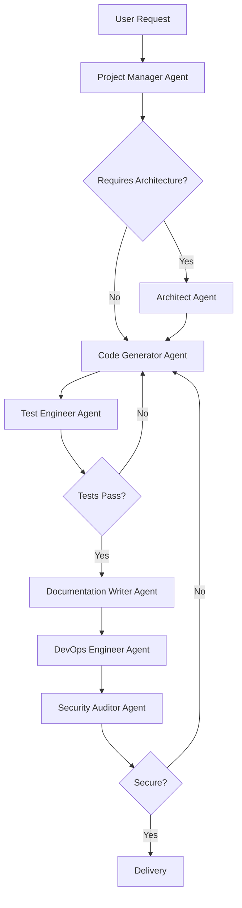

# 🎯 AI Development Master Protocol (ADMP) - Part 2
**Version**: 2.0  
**Last Updated**: January 2026  
**Purpose**: Universal Development Standard for AI-Assisted Software Engineering  
**Compliance**: ISO/IEC 25010, IEEE 829, PMBOK, SWEBOK, UML 2.5

---

## 📋 Table of Contents (Part 2)

5. [Development Standards (continued)](#5-development-standards-continued)
6. [Agent System Architecture](#6-agent-system-architecture)
7. [Testing & Quality Assurance](#7-testing--quality-assurance)
8. [Documentation Standards](#8-documentation-standards)
9. [Delivery & Deployment](#9-delivery--deployment)
10. [Agent Training Data](#10-agent-training-data)
11. [Emergency Protocols](#11-emergency-protocols)
12. [Continuous Improvement](#12-continuous-improvement)
13. [Quick Reference](#13-quick-reference)
14. [Conclusion](#14-conclusion)

---

## 5. Development Standards (continued)

### 5.6 Language-Specific Standards

**Python:**
```python
# Use type hints
def calculate_discount(price: float, discount_rate: float) -> float:
    return price * (1 - discount_rate)

# Use dataclasses for data containers
from dataclasses import dataclass

@dataclass
class User:
    id: int
    name: str
    email: str

# Use context managers
with open('file.txt', 'r') as f:
    content = f.read()

# Use list comprehensions (when readable)
squares = [x**2 for x in range(10)]

# Follow PEP 8
# - 4 spaces for indentation
# - Max line length: 88 (Black formatter)
# - Two blank lines between top-level functions
```

**JavaScript/TypeScript:**
```typescript
// Use TypeScript for type safety
interface User {
  id: number;
  name: string;
  email: string;
}

function calculateDiscount(price: number, discountRate: number): number {
  return price * (1 - discountRate);
}

// Use async/await over callbacks
async function fetchUser(id: number): Promise<User> {
  const response = await fetch(`/api/users/${id}`);
  return response.json();
}

// Use destructuring
const { name, email } = user;

// Use const/let, never var
const API_URL = 'https://api.example.com';
let counter = 0;

// Use arrow functions for callbacks
users.map(user => user.name);
```

---

## 6. Agent System Architecture

### 6.1 Agent Roles & Responsibilities

```yaml
agents:
  project_manager:
    role: "Strategic planning and coordination"
    responsibilities:
      - Create project charter
      - Define success criteria
      - Manage timeline
      - Coordinate other agents
    
  architect:
    role: "System design and technical decisions"
    responsibilities:
      - Create UML diagrams
      - Write ADRs
      - Design database schema
      - Define API contracts
    
  code_generator:
    role: "Implement features"
    responsibilities:
      - Write production code
      - Follow SOLID principles
      - Implement error handling
      - Create modular components
    
  test_engineer:
    role: "Quality assurance"
    responsibilities:
      - Write unit tests
      - Write integration tests
      - Achieve >80% coverage
      - Create test plans
    
  documentation_writer:
    role: "Create and maintain docs"
    responsibilities:
      - Write API documentation
      - Create user guides
      - Update README
      - Maintain changelog
    
  devops_engineer:
    role: "CI/CD and infrastructure"
    responsibilities:
      - Configure GitHub Actions
      - Set up deployment pipelines
      - Manage environments
      - Monitor performance
    
  security_auditor:
    role: "Security review"
    responsibilities:
      - Review code for vulnerabilities
      - Implement security best practices
      - Manage secrets
      - Conduct threat modeling
```

### 6.2 Agent Workflow Sequence



### 6.3 Agent Communication Protocol

**Agent Handoff Template:**

```json
{
  "from_agent": "project_manager",
  "to_agent": "architect",
  "timestamp": "2026-01-28T10:30:00Z",
  "context": {
    "project_charter": "docs/PROJECT_CHARTER.md",
    "requirements": ["REQ-001", "REQ-002", "REQ-003"],
    "constraints": {
      "timeline": "4 weeks",
      "budget": "$50,000",
      "team_size": 5
    }
  },
  "task": {
    "type": "architecture_design",
    "deliverables": [
      "UML diagrams",
      "Database schema",
      "API specification",
      "ADRs"
    ],
    "deadline": "2026-02-04T17:00:00Z"
  },
  "success_criteria": [
    "All UML diagrams complete",
    "Schema normalized to 3NF",
    "API follows REST principles",
    "At least 3 ADRs documented"
  ]
}
```

---

## 7. Testing & Quality Assurance

### 7.1 Testing Pyramid

```
        /\
       /E2E\         10% - End-to-End Tests
      /------\
     /Integration\   20% - Integration Tests
    /------------\
   /  Unit Tests  \  70% - Unit Tests
  /----------------\
```

### 7.2 Test Coverage Requirements

| Component | Minimum Coverage | Target Coverage |
|-----------|------------------|-----------------|
| Core Business Logic | 90% | 95%+ |
| API Endpoints | 80% | 90%+ |
| Services | 85% | 90%+ |
| Utilities | 80% | 85%+ |
| UI Components | 70% | 80%+ |
| **Overall** | **80%** | **85%+** |

### 7.3 Test Naming Convention

```python
# Format: test_<method>_<scenario>_<expected_outcome>

def test_create_user_with_valid_data_returns_user_object():
    pass

def test_create_user_with_duplicate_email_raises_exception():
    pass

def test_calculate_discount_with_zero_rate_returns_original_price():
    pass
```

### 7.4 Test Structure (AAA Pattern)

```python
def test_calculate_total_with_discount():
    # Arrange
    cart = ShoppingCart()
    cart.add_item(Product("Book", 10.00), quantity=2)
    discount = Discount(rate=0.10)  # 10% off
    
    # Act
    total = cart.calculate_total(discount)
    
    # Assert
    assert total == 18.00  # $20 - 10% = $18
```

### 7.5 Test Categories

**Unit Tests:**
```python
# Test one function/method in isolation
def test_validate_email_with_valid_format_returns_true():
    validator = EmailValidator()
    assert validator.validate("user@example.com") == True

def test_validate_email_with_invalid_format_returns_false():
    validator = EmailValidator()
    assert validator.validate("invalid-email") == False
```

**Integration Tests:**
```python
# Test multiple components working together
def test_user_registration_flow_creates_user_and_sends_email():
    # Arrange
    user_service = UserService(db=test_db, email=test_email_service)
    user_data = {"name": "John", "email": "john@example.com"}
    
    # Act
    user = user_service.register(user_data)
    
    # Assert
    assert user.id is not None
    assert test_db.find_user(user.id) is not None
    assert len(test_email_service.sent_emails) == 1
```

**End-to-End Tests:**
```python
# Test complete user workflow
def test_complete_purchase_flow():
    # User logs in
    browser.visit("/login")
    browser.fill("email", "user@example.com")
    browser.fill("password", "password123")
    browser.click("Login")
    
    # User adds product to cart
    browser.visit("/products/123")
    browser.click("Add to Cart")
    
    # User checks out
    browser.visit("/cart")
    browser.click("Checkout")
    browser.fill("credit_card", "4111111111111111")
    browser.click("Complete Purchase")
    
    # Assert success
    assert "Order Confirmed" in browser.text
```

### 7.6 CI/CD Pipeline Requirements

**`.github/workflows/ci.yml`**

```yaml
name: CI Pipeline

on:
  pull_request:
    branches: [dev, main]
  push:
    branches: [dev, main]

jobs:
  lint:
    runs-on: ubuntu-latest
    steps:
      - uses: actions/checkout@v3
      - name: Run Linter
        run: |
          npm run lint  # or pylint, flake8, etc.
  
  test:
    runs-on: ubuntu-latest
    steps:
      - uses: actions/checkout@v3
      - name: Install Dependencies
        run: npm install
      - name: Run Unit Tests
        run: npm test
      - name: Run Integration Tests
        run: npm run test:integration
      - name: Generate Coverage Report
        run: npm run coverage
      - name: Upload Coverage
        uses: codecov/codecov-action@v3
        with:
          files: ./coverage/lcov.info
  
  build:
    runs-on: ubuntu-latest
    needs: [lint, test]
    steps:
      - uses: actions/checkout@v3
      - name: Build Application
        run: npm run build
      - name: Upload Artifacts
        uses: actions/upload-artifact@v3
        with:
          name: build
          path: dist/
  
  security:
    runs-on: ubuntu-latest
    steps:
      - uses: actions/checkout@v3
      - name: Run Security Scan
        run: npm audit
      - name: Run SAST
        uses: github/codeql-action/analyze@v2
```

---

## 8. Documentation Standards

### 8.1 README Structure

```markdown
# Project Name

[]
[]
[]

> One-sentence description of what this project does

## Table of Contents
- [Overview](#overview)
- [Features](#features)
- [Installation](#installation)
- [Usage](#usage)
- [API Documentation](#api-documentation)
- [Contributing](#contributing)
- [License](#license)

## Overview
[2-3 paragraph description of project, its purpose, and its value proposition]

## Features
- ✅ Feature 1: Description
- ✅ Feature 2: Description
- 🚧 Feature 3: In Progress
- 📋 Feature 4: Planned

## Installation

### Prerequisites
- Node.js >= 14.x
- PostgreSQL >= 12.x
- Redis >= 6.x

### Steps
```bash
# Clone the repository
git clone https://github.com/user/repo.git
cd repo

# Install dependencies
npm install

# Configure environment
cp .env.example .env
# Edit .env with your settings

# Run migrations
npm run migrate

# Start development server
npm run dev
```

## Usage

### Quick Start
```javascript
const client = new APIClient({ apiKey: 'your-key' });
const result = await client.fetchData();
```

### Examples
[Link to examples directory]

## API Documentation
[Link to full API docs]

### Authentication
[How to authenticate]

### Endpoints
- `GET /api/users` - List users
- `POST /api/users` - Create user
[etc.]

## Contributing
See [CONTRIBUTING.md](CONTRIBUTING.md)

## License
[License information]

## Support
- Documentation: [link]
- Issues: [link]
- Email: support@example.com
```

### 8.2 API Documentation Standard (OpenAPI/Swagger)

```yaml
openapi: 3.0.0
info:
  title: Project API
  version: 1.0.0
  description: API for managing users and resources
  contact:
    name: API Support
    email: support@example.com

servers:
  - url: https://api.example.com/v1
    description: Production
  - url: https://staging-api.example.com/v1
    description: Staging

paths:
  /users:
    get:
      summary: List all users
      description: Returns a paginated list of users
      tags:
        - Users
      parameters:
        - name: page
          in: query
          schema:
            type: integer
            default: 1
        - name: limit
          in: query
          schema:
            type: integer
            default: 20
      responses:
        '200':
          description: Successful response
          content:
            application/json:
              schema:
                type: object
                properties:
                  data:
                    type: array
                    items:
                      $ref: '#/components/schemas/User'
                  meta:
                    type: object
                    properties:
                      total: integer
                      page: integer
                      limit: integer
        '401':
          description: Unauthorized
        '500':
          description: Internal server error

components:
  schemas:
    User:
      type: object
      required:
        - id
        - email
        - name
      properties:
        id:
          type: integer
          example: 123
        email:
          type: string
          format: email
          example: user@example.com
        name:
          type: string
          example: John Doe
        created_at:
          type: string
          format: date-time
```

### 8.3 Code Documentation Standards

**Python (Docstrings):**

```python
def calculate_compound_interest(
    principal: float,
    rate: float,
    time: int,
    frequency: int = 1
) -> float:
    """
    Calculate compound interest.
    
    This function computes the future value of an investment based on
    compound interest calculations using the formula:
    A = P(1 + r/n)^(nt)
    
    Args:
        principal: The initial investment amount in currency units.
        rate: The annual interest rate as a decimal (e.g., 0.05 for 5%).
        time: The investment period in years.
        frequency: The number of times interest is compounded per year.
                   Defaults to 1 (annual compounding).
    
    Returns:
        The future value of the investment including interest.
    
    Raises:
        ValueError: If principal, rate, or time is negative, or if
                    frequency is less than 1.
    
    Examples:
        >>> calculate_compound_interest(1000, 0.05, 10)
        1628.89
        
        >>> calculate_compound_interest(5000, 0.03, 5, frequency=4)
        5805.92
    
    Note:
        This function assumes constant interest rates and does not
        account for taxes or fees.
    
    See Also:
        calculate_simple_interest: For simple interest calculations.
    """
    if principal < 0 or rate < 0 or time < 0:
        raise ValueError("Principal, rate, and time must be non-negative")
    if frequency < 1:
        raise ValueError("Frequency must be at least 1")
    
    amount = principal * (1 + rate / frequency) ** (frequency * time)
    return round(amount, 2)
```

**JavaScript (JSDoc):**

```javascript
/**
 * Calculate compound interest.
 * 
 * This function computes the future value of an investment based on
 * compound interest calculations using the formula: A = P(1 + r/n)^(nt)
 * 
 * @param {number} principal - The initial investment amount
 * @param {number} rate - The annual interest rate as a decimal (e.g., 0.05 for 5%)
 * @param {number} time - The investment period in years
 * @param {number} [frequency=1] - Number of times interest is compounded per year
 * @returns {number} The future value of investment including interest
 * @throws {Error} If principal, rate, or time is negative, or if frequency < 1
 * 
 * @example
 * // Returns 1628.89
 * calculateCompoundInterest(1000, 0.05, 10);
 * 
 * @example
 * // Returns 5805.92
 * calculateCompoundInterest(5000, 0.03, 5, 4);
 */
function calculateCompoundInterest(principal, rate, time, frequency = 1) {
  if (principal < 0 || rate < 0 || time < 0) {
    throw new Error("Principal, rate, and time must be non-negative");
  }
  if (frequency < 1) {
    throw new Error("Frequency must be at least 1");
  }
  
  const amount = principal * Math.pow(1 + rate / frequency, frequency * time);
  return Math.round(amount * 100) / 100;
}
```

### 8.4 CHANGELOG Format

```markdown
# Changelog
All notable changes to this project will be documented in this file.

The format is based on [Keep a Changelog](https://keepachangelog.com/en/1.0.0/),
and this project adheres to [Semantic Versioning](https://semver.org/spec/v2.0.0.html).

## [Unreleased]
### Added
- New feature X for better performance

### Changed
- Updated dependency Y to version 2.0

### Deprecated
- Feature Z will be removed in version 3.0

## [1.2.0] - 2026-01-28
### Added
- User authentication system (#123)
- API rate limiting (#124)
- Comprehensive test suite achieving 87% coverage (#125)

### Changed
- Improved database query performance by 40% (#126)
- Updated UI to Material Design 3 (#127)

### Fixed
- Resolved memory leak in background worker (#128)
- Fixed race condition in order processing (#129)

### Security
- Patched SQL injection vulnerability in search endpoint (CVE-2026-XXXXX)

## [1.1.0] - 2026-01-15
### Added
- Export to CSV functionality (#110)
- Dark mode support (#111)

### Fixed
- Login button not working on mobile (#112)

## [1.0.0] - 2026-01-01
### Added
- Initial release
- User management
- Product catalog
- Order processing
```

---

## 9. Delivery & Deployment

### 9.1 Definition of Done (DoD)

```markdown
## Feature is considered DONE when:

### Code
- [ ] Code is written following all standards in this document
- [ ] Code review completed by 2+ team members
- [ ] No merge conflicts
- [ ] All linters pass
- [ ] No hardcoded values or secrets

### Testing
- [ ] Unit tests written with >80% coverage
- [ ] Integration tests written (if applicable)
- [ ] All tests pass in CI/CD
- [ ] Manual testing completed
- [ ] Performance tested (if applicable)

### Documentation
- [ ] Code comments added where necessary
- [ ] API documentation updated
- [ ] README updated (if applicable)
- [ ] CHANGELOG updated
- [ ] Migration guide written (for breaking changes)

### Quality
- [ ] Security scan passed
- [ ] Accessibility standards met (WCAG 2.1 AA)
- [ ] Browser compatibility verified
- [ ] Mobile responsiveness verified

### Deployment
- [ ] Staging deployment successful
- [ ] Production deployment plan reviewed
- [ ] Rollback plan documented
- [ ] Monitoring/alerts configured

### Stakeholder
- [ ] Product Owner approved
- [ ] Design review passed (if UI changes)
- [ ] Demo given to stakeholders
```

### 9.2 Release Checklist

```markdown
## Pre-Release
- [ ] All DoD items complete
- [ ] Version number updated (semantic versioning)
- [ ] CHANGELOG updated
- [ ] Release notes drafted
- [ ] Dependencies updated to stable versions
- [ ] Security vulnerabilities addressed
- [ ] Database migrations tested
- [ ] Backward compatibility verified
- [ ] Performance benchmarks meet targets

## Release
- [ ] Tag created: `git tag -a v1.2.0 -m "Release v1.2.0"`
- [ ] Tag pushed: `git push origin v1.2.0`
- [ ] GitHub release created with notes
- [ ] Artifacts published (npm, PyPI, Docker Hub, etc.)
- [ ] Documentation site updated
- [ ] CDN caches purged (if applicable)

## Post-Release
- [ ] Production deployment verified
- [ ] Smoke tests passed
- [ ] Monitoring shows normal metrics
- [ ] No critical errors in logs
- [ ] Stakeholders notified
- [ ] Social media/blog post published
- [ ] Support team briefed on changes
```

### 9.3 Deployment Strategies

**Blue-Green Deployment:**
```yaml
strategy: blue-green
description: "Two identical environments, switch traffic instantly"
steps:
  1: Deploy to green environment (idle)
  2: Run smoke tests on green
  3: Switch traffic from blue to green
  4: Monitor green for issues
  5: Keep blue as quick rollback option
pros:
  - Zero downtime
  - Instant rollback
cons:
  - Double infrastructure cost
```

**Canary Deployment:**
```yaml
strategy: canary
description: "Gradual rollout to subset of users"
steps:
  1: Deploy to 5% of servers
  2: Monitor for 1 hour
  3: If stable, deploy to 25%
  4: Monitor for 2 hours
  5: If stable, deploy to 100%
rollback_trigger:
  - Error rate > 1%
  - Latency > 500ms
  - CPU usage > 80%
```

---

## 10. Agent Training Data

### 10.1 Agent Configuration JSON

**File: `config/agent-training.json`**

```json
{
  "version": "2.0",
  "last_updated": "2026-01-28",
  "protocol_version": "ADMP-2.0",
  
  "global_rules": {
    "before_coding": [
      "Read entire ADMP protocol",
      "Confirm project requirements complete",
      "Create project structure",
      "Initialize Git repository",
      "Set up testing framework",
      "Create documentation templates"
    ],
    "during_coding": [
      "Follow SOLID principles",
      "Write tests alongside code",
      "Commit frequently with conventional commits",
      "Document complex logic",
      "Run linter before committing"
    ],
    "after_coding": [
      "Verify all tests pass",
      "Update documentation",
      "Create Pull Request",
      "Request code review",
      "Update CHANGELOG"
    ]
  },
  
  "agents": {
    "project_manager": {
      "initialization_prompt": "You are a Project Manager AI. Before starting any project, you must: 1) Create a project charter, 2) Define success criteria, 3) Identify stakeholders, 4) Create initial timeline, 5) Set up project board with issues.",
      "required_outputs": [
        "docs/PROJECT_CHARTER.md",
        "docs/ROADMAP.md",
        "GitHub Project board",
        "Initial GitHub Issues"
      ],
      "success_criteria": {
        "charter_complete": true,
        "stakeholders_identified": true,
        "timeline_defined": true,
        "board_created": true
      }
    },
    
    "architect": {
      "initialization_prompt": "You are a Software Architect AI. Before any code is written, you must: 1) Create UML diagrams (use case, class, sequence, component, deployment), 2) Write Architecture Decision Records (ADRs), 3) Design database schema, 4) Define API contracts, 5) Document technology choices.",
      "required_outputs": [
        "docs/diagrams/*.puml",
        "docs/adr/*.md",
        "docs/ARCHITECTURE.md",
        "docs/api/openapi.yml"
      ],
      "validation_rules": {
        "diagrams_present": ["use-case", "class", "sequence", "component", "deployment"],
        "adr_count": "minimum 3",
        "api_spec_valid": true
      }
    },
    
    "code_generator": {
      "initialization_prompt": "You are a Code Generator AI. You MUST follow SOLID principles, write clean code, and include error handling. Before writing code: 1) Understand requirements, 2) Review architecture, 3) Check existing codebase patterns, 4) Plan implementation, 5) Write tests first (TDD).",
      "code_standards": {
        "principles": ["SOLID", "DRY", "KISS", "YAGNI"],
        "max_function_length": 50,
        "max_file_length": 300,
        "naming_convention": {
          "python": "snake_case",
          "javascript": "camelCase",
          "constants": "UPPER_SNAKE_CASE"
        }
      },
      "required_checks": [
        "All functions have type hints/types",
        "Error handling present",
        "Input validation implemented",
        "No hardcoded values",
        "Proper logging added"
      ]
    },
    
    "test_engineer": {
      "initialization_prompt": "You are a Test Engineer AI. Your job is to ensure >80% code coverage and comprehensive testing. For every feature: 1) Write unit tests, 2) Write integration tests, 3) Write E2E tests (if applicable), 4) Create test data/fixtures, 5) Document test scenarios.",
      "coverage_targets": {
        "overall": 80,
        "core_logic": 90,
        "api_endpoints": 85,
        "utilities": 80
      },
      "test_structure": "AAA (Arrange-Act-Assert)",
      "naming_convention": "test_<method>_<scenario>_<outcome>",
      "required_test_types": ["unit", "integration"]
    },
    
    "documentation_writer": {
      "initialization_prompt": "You are a Documentation Writer AI. You create clear, comprehensive documentation. For every feature: 1) Update README, 2) Write/update API docs, 3) Create examples, 4) Update CHANGELOG, 5) Write inline code comments where needed.",
      "required_sections": {
        "README": ["Overview", "Installation", "Usage", "API", "Contributing"],
        "API_DOCS": ["Authentication", "Endpoints", "Examples", "Error Codes"],
        "CODE_COMMENTS": "Complex logic only, explain why not what"
      },
      "style_guide": {
        "tone": "professional but approachable",
        "code_examples": "always include",
        "diagrams": "when helpful for understanding"
      }
    },
    
    "devops_engineer": {
      "initialization_prompt": "You are a DevOps Engineer AI. You set up CI/CD and infrastructure. Your tasks: 1) Configure GitHub Actions, 2) Set up environments, 3) Configure deployment pipelines, 4) Set up monitoring, 5) Document deployment process.",
      "required_pipelines": ["CI (lint, test, build)", "CD (deploy)"],
      "environments": ["development", "staging", "production"],
      "required_checks": {
        "ci": ["linter", "tests", "coverage", "security_scan", "build"],
        "cd": ["deploy", "smoke_tests", "rollback_plan"]
      }
    },
    
    "security_auditor": {
      "initialization_prompt": "You are a Security Auditor AI. You review code for security vulnerabilities. For every PR: 1) Check for SQL injection risks, 2) Check for XSS vulnerabilities, 3) Verify authentication/authorization, 4) Check for exposed secrets, 5) Review dependencies.",
      "owasp_top_10": [
        "Injection",
        "Broken Authentication",
        "Sensitive Data Exposure",
        "XML External Entities (XXE)",
        "Broken Access Control",
        "Security Misconfiguration",
        "Cross-Site Scripting (XSS)",
        "Insecure Deserialization",
        "Using Components with Known Vulnerabilities",
        "Insufficient Logging & Monitoring"
      ],
      "automated_tools": ["npm audit", "snyk", "dependabot", "codeql"]
    }
  },
  
  "workflows": {
    "new_feature": {
      "sequence": [
        {"agent": "project_manager", "task": "create_issue"},
        {"agent": "architect", "task": "design_solution"},
        {"agent": "code_generator", "task": "implement"},
        {"agent": "test_engineer", "task": "test"},
        {"agent": "documentation_writer", "task": "document"},
        {"agent": "devops_engineer", "task": "deploy"},
        {"agent": "security_auditor", "task": "audit"}
      ],
      "parallel_allowed": ["code_generator", "test_engineer"]
    },
    
    "bug_fix": {
      "sequence": [
        {"agent": "project_manager", "task": "triage_bug"},
        {"agent": "code_generator", "task": "fix"},
        {"agent": "test_engineer", "task": "regression_test"},
        {"agent": "documentation_writer", "task": "update_changelog"},
        {"agent": "devops_engineer", "task": "hotfix_deploy"}
      ]
    },
    
    "documentation_update": {
      "sequence": [
        {"agent": "documentation_writer", "task": "update_docs"},
        {"agent": "project_manager", "task": "review"}
      ]
    }
  },
  
  "quality_gates": {
    "code_review": {
      "required_approvals": 2,
      "required_checks": ["lint", "test", "coverage", "security"]
    },
    "merge_to_main": {
      "required_approvals": 2,
      "required_checks": ["all_ci_passed", "documentation_updated", "changelog_updated"],
      "branch_protection": true
    }
  },
  
  "metrics": {
    "kpis": [
      {"name": "Code Coverage", "target": 80, "unit": "percentage"},
      {"name": "Bug Density", "target": 5, "unit": "bugs_per_kloc"},
      {"name": "Mean Time to Recover", "target": 30, "unit": "minutes"},
      {"name": "Deployment Frequency", "target": "daily", "unit": "deployments"},
      {"name": "Lead Time for Changes", "target": 24, "unit": "hours"}
    ]
  }
}
```

### 10.2 Pre-Flight Checklist JSON

**File: `config/preflight-checklist.json`**

```json
{
  "version": "1.0",
  "description": "Checklist that must be completed before any coding begins",
  
  "phase_1_requirements": {
    "name": "Requirements Gathering",
    "items": [
      {
        "id": "REQ-001",
        "task": "Project charter created",
        "file": "docs/PROJECT_CHARTER.md",
        "mandatory": true
      },
      {
        "id": "REQ-002",
        "task": "Stakeholders identified",
        "validation": "at_least_3",
        "mandatory": true
      },
      {
        "id": "REQ-003",
        "task": "Success criteria defined",
        "validation": "measurable",
        "mandatory": true
      },
      {
        "id": "REQ-004",
        "task": "Timeline established",
        "validation": "has_milestones",
        "mandatory": true
      }
    ]
  },
  
  "phase_2_architecture": {
    "name": "Architecture & Design",
    "items": [
      {
        "id": "ARCH-001",
        "task": "Use Case Diagram created",
        "file": "docs/diagrams/use-cases.puml",
        "mandatory": true
      },
      {
        "id": "ARCH-002",
        "task": "Class Diagram created",
        "file": "docs/diagrams/class-diagram.puml",
        "mandatory": true
      },
      {
        "id": "ARCH-003",
        "task": "Sequence Diagrams created",
        "file": "docs/diagrams/sequences/",
        "validation": "at_least_3",
        "mandatory": true
      },
      {
        "id": "ARCH-004",
        "task": "Component Diagram created",
        "file": "docs/diagrams/components.puml",
        "mandatory": true
      },
      {
        "id": "ARCH-005",
        "task": "Deployment Diagram created",
        "file": "docs/diagrams/deployment.puml",
        "mandatory": true
      },
      {
        "id": "ARCH-006",
        "task": "Database schema designed",
        "file": "docs/database-schema.md",
        "validation": "normalized_3NF",
        "mandatory": true
      },
      {
        "id": "ARCH-007",
        "task": "API specification created",
        "file": "docs/api/openapi.yml",
        "validation": "valid_openapi_3",
        "mandatory": true
      },
      {
        "id": "ARCH-008",
        "task": "ADRs documented",
        "directory": "docs/adr/",
        "validation": "at_least_3",
        "mandatory": true
      }
    ]
  },
  
  "phase_3_setup": {
    "name": "Project Setup",
    "items": [
      {
        "id": "SETUP-001",
        "task": "Directory structure created",
        "validation": "follows_standard",
        "mandatory": true
      },
      {
        "id": "SETUP-002",
        "task": "Git repository initialized",
        "validation": "has_branches_main_dev",
        "mandatory": true
      },
      {
        "id": "SETUP-003",
        "task": "README.md created",
        "file": "README.md",
        "validation": "has_required_sections",
        "mandatory": true
      },
      {
        "id": "SETUP-004",
        "task": "CONTRIBUTING.md created",
        "file": "CONTRIBUTING.md",
        "mandatory": true
      },
      {
        "id": "SETUP-005",
        "task": ".gitignore configured",
        "file": ".gitignore",
        "mandatory": true
      },
      {
        "id": "SETUP-006",
        "task": "Linter configured",
        "files": [".eslintrc", ".pylintrc", "pyproject.toml"],
        "validation": "one_present",
        "mandatory": true
      },
      {
        "id": "SETUP-007",
        "task": "Testing framework set up",
        "validation": "tests_run",
        "mandatory": true
      },
      {
        "id": "SETUP-008",
        "task": "CI/CD pipeline configured",
        "file": ".github/workflows/ci.yml",
        "mandatory": true
      },
      {
        "id": "SETUP-009",
        "task": "GitHub Project board created",
        "validation": "has_columns",
        "mandatory": true
      },
      {
        "id": "SETUP-010",
        "task": "Initial issues created",
        "validation": "at_least_5",
        "mandatory": true
      }
    ]
  },
  
  "validation_script": {
    "description": "Python script to validate checklist completion",
    "file": "scripts/validate_preflight.py",
    "example": "python scripts/validate_preflight.py --config config/preflight-checklist.json"
  }
}
```

### 10.3 Example Validation Script

**File: `scripts/validate_preflight.py`**

```python
#!/usr/bin/env python3
"""
Preflight Validation Script
Validates that all required setup is complete before coding begins.
"""

import json
import sys
from pathlib import Path
from typing import Dict, List, Tuple


class PreflightValidator:
    def __init__(self, config_path: str):
        with open(config_path) as f:
            self.config = json.load(f)
        self.results: List[Tuple[str, bool, str]] = []
    
    def validate_phase(self, phase: Dict) -> bool:
        """Validate all items in a phase."""
        phase_passed = True
        print(f"\n{'='*60}")
        print(f"Validating: {phase['name']}")
        print(f"{'='*60}")
        
        for item in phase['items']:
            passed, message = self.validate_item(item)
            self.results.append((item['task'], passed, message))
            
            status = "✅ PASS" if passed else "❌ FAIL"
            print(f"{status} [{item['id']}] {item['task']}")
            if not passed:
                print(f"      {message}")
                phase_passed = False
        
        return phase_passed
    
    def validate_item(self, item: Dict) -> Tuple[bool, str]:
        """Validate a single checklist item."""
        # Check if file exists
        if 'file' in item:
            if not Path(item['file']).exists():
                return False, f"File not found: {item['file']}"
        
        # Check if directory exists and has content
        if 'directory' in item:
            path = Path(item['directory'])
            if not path.exists():
                return False, f"Directory not found: {item['directory']}"
            
            if 'validation' in item and item['validation'] == 'at_least_3':
                if len(list(path.glob('*.md'))) < 3:
                    return False, f"Expected at least 3 files in {item['directory']}"
        
        # Additional validation rules can be added here
        
        return True, "OK"
    
    def run(self) -> bool:
        """Run all validations."""
        print("\n" + "="*60)
        print("PREFLIGHT VALIDATION")
        print("="*60)
        
        all_passed = True
        
        for phase_key in ['phase_1_requirements', 'phase_2_architecture', 'phase_3_setup']:
            if phase_key in self.config:
                phase_passed = self.validate_phase(self.config[phase_key])
                all_passed = all_passed and phase_passed
        
        # Print summary
        print("\n" + "="*60)
        print("SUMMARY")
        print("="*60)
        
        total = len(self.results)
        passed = sum(1 for _, p, _ in self.results if p)
        failed = total - passed
        
        print(f"Total checks: {total}")
        print(f"✅ Passed: {passed}")
        print(f"❌ Failed: {failed}")
        
        if all_passed:
            print("\n🎉 ALL CHECKS PASSED - Ready to start coding!")
            return True
        else:
            print("\n⚠️  SOME CHECKS FAILED - Complete setup before coding!")
            return False


def main():
    if len(sys.argv) < 2:
        print("Usage: python validate_preflight.py <config-file>")
        sys.exit(1)
    
    validator = PreflightValidator(sys.argv[1])
    success = validator.run()
    
    sys.exit(0 if success else 1)


if __name__ == "__main__":
    main()
```

---

## 11. Emergency Protocols

### 11.1 Production Incident Response

```yaml
severity_levels:
  P0_critical:
    description: "System down, data loss, security breach"
    response_time: "15 minutes"
    notification: "All hands on deck"
    
  P1_high:
    description: "Major feature broken, significant user impact"
    response_time: "1 hour"
    notification: "On-call engineer + manager"
    
  P2_medium:
    description: "Minor feature broken, limited user impact"
    response_time: "4 hours"
    notification: "On-call engineer"
    
  P3_low:
    description: "Cosmetic issue, no user impact"
    response_time: "Next sprint"
    notification: "Create ticket"

incident_response_steps:
  1_detect: "Monitoring alerts or user report"
  2_triage: "Assess severity and impact"
  3_mitigate: "Stop the bleeding (rollback, disable feature, etc.)"
  4_communicate: "Update status page and stakeholders"
  5_fix: "Implement permanent fix"
  6_verify: "Confirm fix resolves issue"
  7_postmortem: "Write blameless postmortem within 48 hours"
```

### 11.2 Rollback Procedure

```bash
#!/bin/bash
# Emergency Rollback Script

echo "🚨 EMERGENCY ROLLBACK INITIATED"
echo "================================"

# 1. Get last stable version
LAST_STABLE=$(git describe --tags --abbrev=0 HEAD~1)
echo "Rolling back to: $LAST_STABLE"

# 2. Confirm with operator
read -p "Proceed with rollback to $LAST_STABLE? (yes/no): " CONFIRM
if [ "$CONFIRM" != "yes" ]; then
    echo "Rollback cancelled"
    exit 1
fi

# 3. Execute rollback
git checkout $LAST_STABLE
docker-compose down
docker-compose up -d

# 4. Run smoke tests
npm run test:smoke

# 5. Verify health
curl -f http://localhost:8080/health || {
    echo "❌ Health check failed"
    exit 1
}

echo "✅ Rollback complete"
echo "📝 Create incident report: docs/incidents/$(date +%Y%m%d)-rollback.md"
```

---

## 12. Continuous Improvement

### 12.1 Sprint Retrospective Template

```markdown
# Sprint Retrospective - Sprint X

**Date**: YYYY-MM-DD
**Attendees**: [Names]
**Facilitator**: [Name]

## What Went Well ✅
- Item 1
- Item 2
- Item 3

## What Could Be Improved 🔄
- Item 1
- Item 2
- Item 3

## Action Items 🎯
| Action | Owner | Due Date | Status |
|--------|-------|----------|--------|
| Action 1 | Name | Date | ⏳ Pending |
| Action 2 | Name | Date | ✅ Done |

## Metrics
- Velocity: X story points
- Bugs reported: X
- Bugs fixed: X
- Code coverage: X%
- Deployment frequency: X per week

## Next Sprint Focus
- Focus area 1
- Focus area 2
```

### 12.2 Protocol Update Process

```markdown
## How to Update This Protocol

1. **Identify Need**: Document why update is needed
2. **Draft Changes**: Create PR with proposed changes
3. **Team Review**: All team members review and comment
4. **Approval**: Requires 2/3 majority approval
5. **Version Update**: Increment version number
6. **Training**: Brief team on changes
7. **Rollout**: Update takes effect next sprint

## Version History
- v2.0 (2026-01-28): Added agent training data
- v1.5 (2025-12-15): Enhanced testing standards
- v1.0 (2025-11-01): Initial release
```

---

## 13. Quick Reference

### 13.1 Command Cheatsheet

```bash
# Project Setup
git clone <repo>
cd <repo>
python scripts/validate_preflight.py config/preflight-checklist.json

# Development
git checkout dev
git pull origin dev
git checkout -b feature/ABC-123-description
# [write code]
git add .
git commit -m "feat(module): description"
git push origin feature/ABC-123-description
gh pr create --base dev

# Testing
npm test
npm run test:coverage
npm run test:e2e

# Code Quality
npm run lint
npm run format
npm run type-check

# Deployment
npm run build
npm run deploy:staging
npm run deploy:production
```

### 13.2 File Templates Location

```
templates/
├── PROJECT_CHARTER.md
├── ADR_TEMPLATE.md
├── API_SPEC_TEMPLATE.yml
├── TEST_PLAN_TEMPLATE.md
├── INCIDENT_REPORT_TEMPLATE.md
└── SPRINT_RETROSPECTIVE_TEMPLATE.md
```

---

## 14. Conclusion

This protocol is not optional. It is the foundation of professional software development.

**Every AI agent must:**
1. Read this entire document before starting any project
2. Follow all rules without exception
3. Request clarification when needed
4. Suggest improvements to this protocol
5. Help enforce these standards

**Remember**: Consistency, quality, and professionalism are not negotiable. They are the price of entry for world-class software engineering.

---

**Protocol Maintainer**: [Name]  
**Last Review**: 2026-01-28  
**Next Review**: 2026-04-28  
**Questions?**: protocol@example.com

---

*"Excellence is not an act, but a habit." - Aristotle*